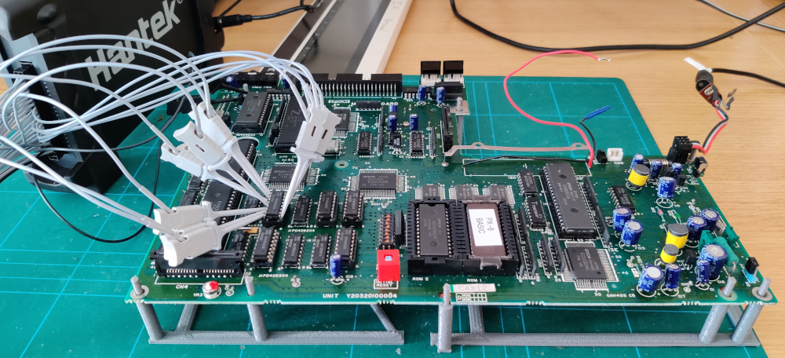

# Epson PX8 PCB Jig

This is a quick and dirty 3D printable jig for holding the main PCB of an Epson PX8 portable computer.

It makes it easier to probe and prod at the signals whilst still being able to attach the screen and keyboard.

Comes in 2 parts to fit on my printer bed.

